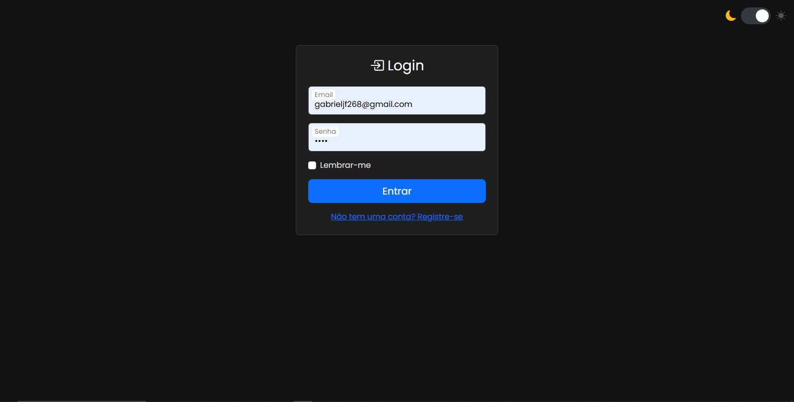
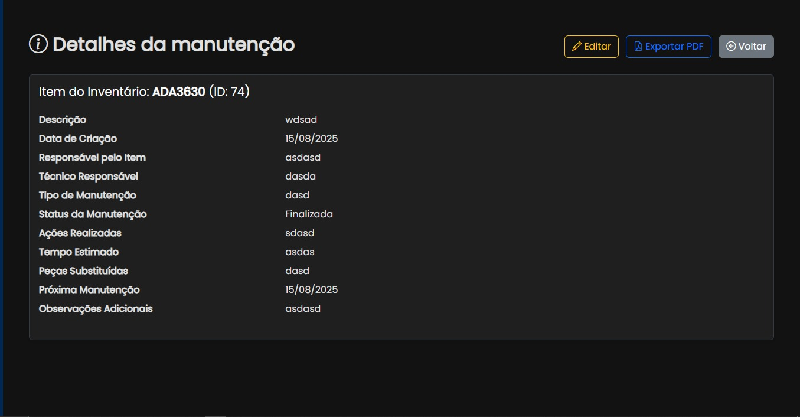

# SistemPlanilha - Sistema de Inventário e Manutenção

Este projeto consiste em um sistema web completo desenvolvido em ASP.NET Core MVC para gerenciar o inventário de equipamentos de TI e o fluxo de trabalho de manutenções associadas.

## Visão Geral

O SistemPlanilha foi concebido para simplificar e otimizar o controle do parque tecnológico de uma organização, permitindo o rastreamento de ativos, o registro de manutenções e a geração de informações relevantes para a tomada de decisões. Ele substitui planilhas manuais por uma plataforma centralizada, segura e intuitiva.

### O Que Ele Faz?

* **Gestão de Inventário:** Cadastro, visualização, edição e inativação (delete lógico) de itens, com um histórico completo de auditoria.
* **Controle de Manutenções:** Registro e acompanhamento de todo o ciclo de vida de uma manutenção, desde a abertura do chamado até sua conclusão.
* **Dashboard Informativo:** Apresentação de uma visão geral do sistema através de cards de resumo e um gráfico dinâmâmico da distribuição do inventário por situação.
* **Auditoria Completa:** Registro em tabela separada de todas as ações de criação, atualização e exclusão, informando o quê, quando e quem realizou a ação.
* **Autenticação e Autorização:** Sistema de login e registro para garantir que apenas usuários autorizados acessem os dados.
* **API RESTful:** Exposição dos dados de Inventário e Manutenções através de endpoints seguros, permitindo a integração com outras ferramentas.

### Como Foi Pensado (Arquitetura)

O sistema foi desenvolvido seguindo os princípios de uma arquitetura em camadas para garantir a separação de responsabilidades, facilitando a manutenção e a escalabilidade.

* **Camada de Apresentação (`Controllers` e `Views`):** Interface do usuário construída com ASP.NET Core MVC e Razor, utilizando ViewModels específicas para cada tela e ação (padrão Command/Query).
* **Camada de Aplicação (`Application`):** Orquestra os casos de uso, recebendo dados dos controllers, chamando os serviços de domínio e repositórios, e retornando os resultados. É o "gerente" da aplicação.
* **Camada de Domínio (`Domain/Services`):** Contém a lógica de negócio pura e as regras mais importantes do sistema (ex: validação de patrimônio duplicado), sem depender de outras camadas. É o "especialista".
* **Camada de Infraestrutura (`Data` e `Repositorio`):** Abstrai o acesso a dados utilizando o padrão Repositório e o Entity Framework Core para se comunicar com o banco de dados SQL Server.

## Screenshots
#### Dashboard Principal

#### Listagem e Filtros de Inventário

#### Formulário Criação (Modal)

#### Tela de Login

#### Detalhes da Manutenção

## Tecnologias Utilizadas

* **Backend:** .NET 8, ASP.NET Core MVC, Entity Framework Core, ASP.NET Core Identity
* **Banco de Dados:** Microsoft SQL Server
* **Frontend:** HTML, CSS, JavaScript, Bootstrap 5, Chart.js
* **Arquitetura:** Padrão MVC com separação em camadas (Application, Domain, Repository), ViewModels específicas (Command/Query), Injeção de Dependência.
* **Ferramentas:** Visual Studio 2022, Git, GitHub, Swagger (OpenAPI)

## Contribuição
Obrigado ao meu Gestor João e aos colegas programadores que me auxiliaram em dúvidas no processo de criação do sistema.
